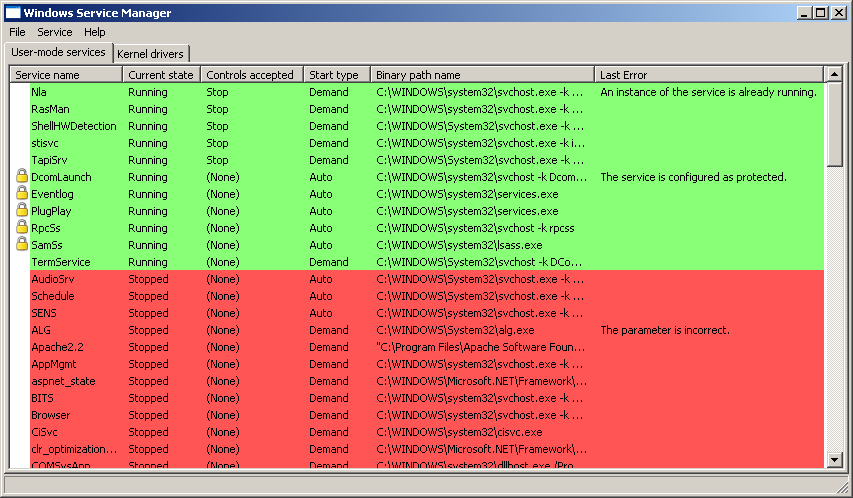

## Enhanced Windows service manager

This tool manages Windows services. You can start/stop/enable/disable multiple services at a time.

### Installation

To use this tool:

1. Install Python 2.
2. Install pywin32 from https://github.com/mhammond/pywin32/releases.
3. Install wxPython (`pip install wxPython`).
4. Execute `pythonw windows_service_manager.py`.

### Screenshot

